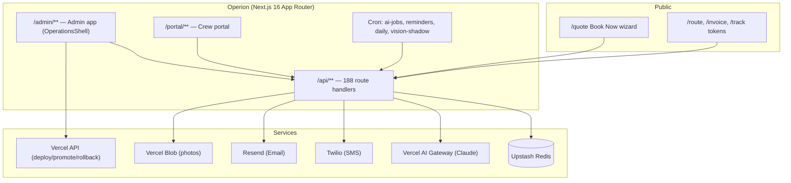
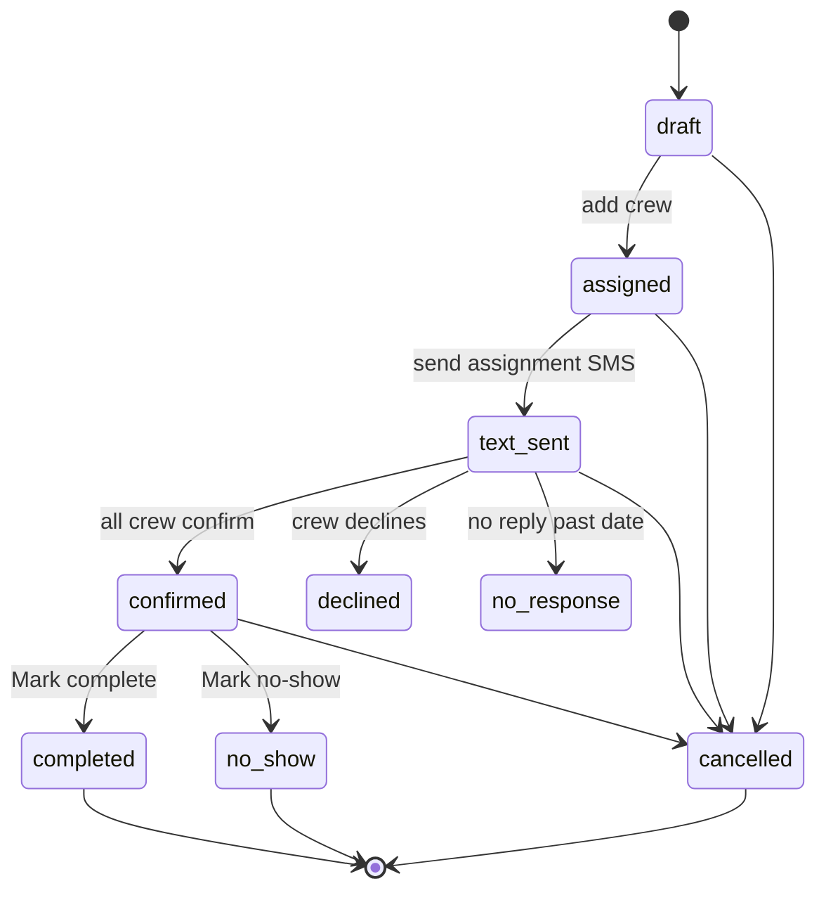
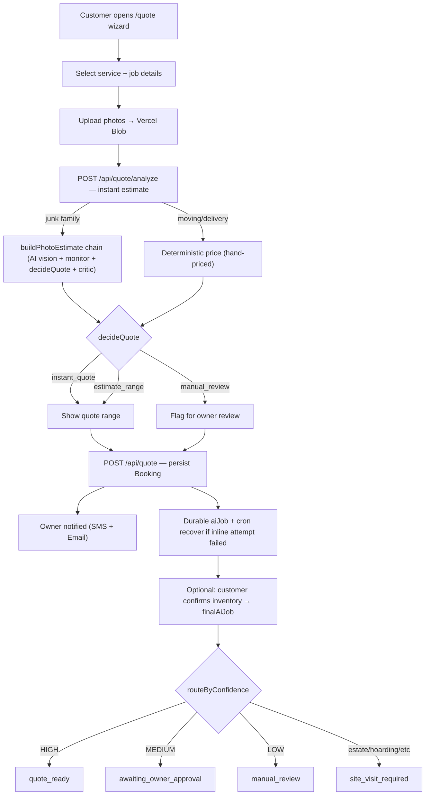
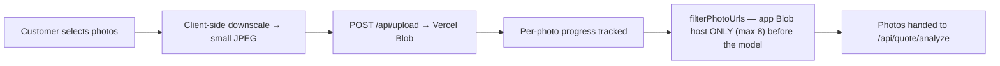
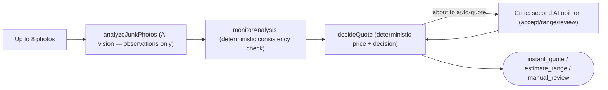
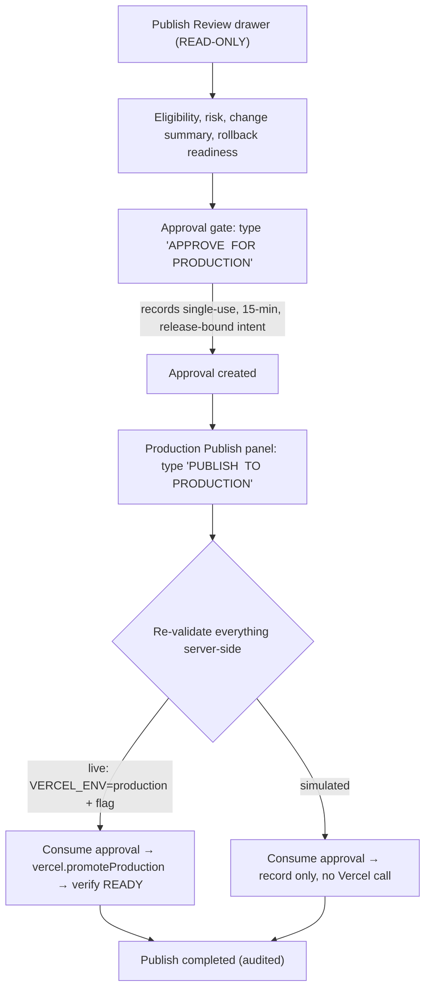
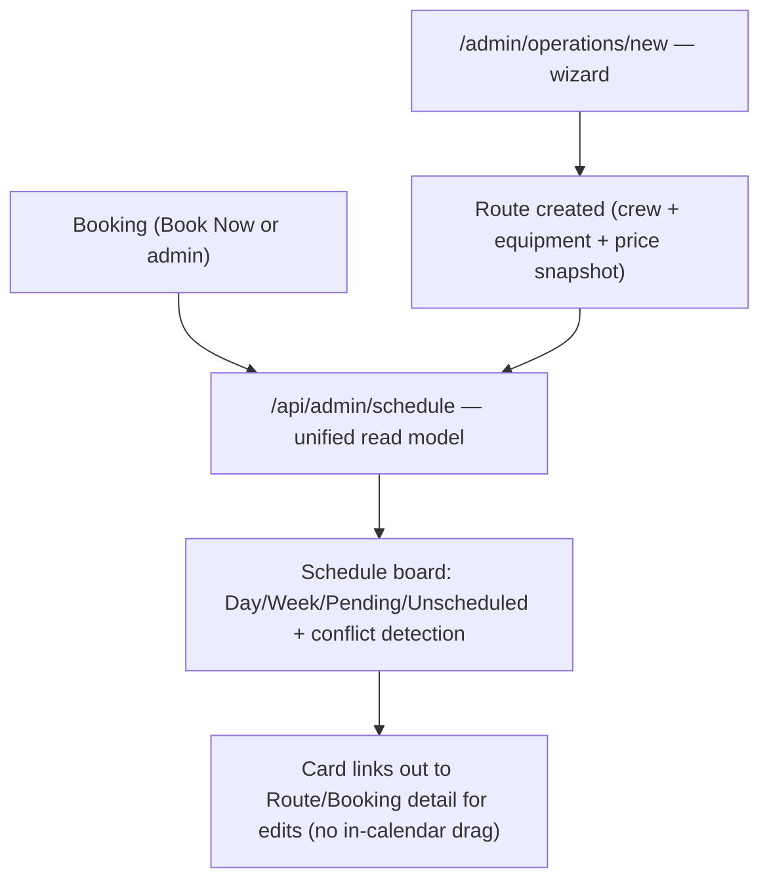

<!-- Operion — Administrator User Manual. Living documentation generated from the codebase. -->

# Operion
## Administrator User Manual

| | |
|---|---|
| **Product** | Operion (admin surface also branded *OpsPilot*; tenant instance *J KISS LLC / “J KISS Freight”*) |
| **Version** | 0.1.0 (`package.json`) |
| **Build framework** | Next.js 16.2.2 (App Router) · Node.js runtime · Upstash Redis storage |
| **Repository commit** | `80b7989f7ecaf788fa0899ab262c45a98e3678d6` (branch `main`) |
| **Generated** | 2026‑07‑20 |
| **Status** | Living document — regenerate after significant releases |

> **About this manual.** This is internal operational documentation, not marketing
> material. Every feature described was verified against the source at the commit
> above. Features that are incomplete, simulated, or gated behind a disabled
> feature flag are labeled as such. Anything planned-but-not-built lives in
> **Appendix E — Future Features**, never in the main body.

### Revision History

| Version | Date | Commit | Summary |
|---|---|---|---|
| 1.0 | 2026‑07‑20 | `80b7989` | Initial code-verified manual: full page/route inventory, all subsystems, workflow diagrams, coverage report. |

---

# Table of Contents

1. [Introduction](#1-introduction)
2. [Logging In](#2-logging-in)
3. [Dashboard](#3-dashboard)
4. [Navigation](#4-navigation)
5. [Customer Management](#5-customer-management)
6. [Operations](#6-operations)
7. [Book Now](#7-book-now)
8. [AI Features](#8-ai-features)
9. [Claims](#9-claims)
10. [Crew Management](#10-crew-management)
11. [Calendar & Schedule](#11-calendar--schedule)
12. [Reports](#12-reports)
13. [Notifications](#13-notifications)
14. [AI Configuration](#14-ai-configuration)
15. [Release Center](#15-release-center)
16. [Settings](#16-settings)
17. [Security](#17-security)
18. [Troubleshooting](#18-troubleshooting)
19. [FAQ](#19-faq)
20. [Best Practices](#20-best-practices)
21. [Keyboard Shortcuts](#21-keyboard-shortcuts)
22. [Error Messages](#22-error-messages)
23. [Appendix](#23-appendix)

> **Cross-reference key:** “§n” means Section n of this manual. Routes are shown as
> `/admin/...`. Feature-flag names are shown in `MONOSPACE`; all flags and their
> defaults are tabulated in §15.9 and Appendix A.

---

# 1 Introduction

## 1.1 Purpose
Operion is the back-office platform an administrator uses to run a field-service
operation end to end: intake customer bookings (including an AI-assisted “Book
Now” quote), dispatch crews on routes, track jobs to completion, handle damage
claims and cost recovery, pay contractors, invoice business clients, and — for the
platform owner — manage releases across products. This manual documents every
administrator-facing screen and workflow as implemented.

## 1.2 Who this guide is for
- **Administrators** running day-to-day operations.
- **Support & onboarding staff** learning the platform.
- **QA** validating behavior against documented intent.
- **Platform owner(s)** operating the owner-only Release Center, AI Command Center, and Platform tooling.

Assume the reader has never used Operion before.

## 1.3 Administrator responsibilities
| Area | Responsibility |
|---|---|
| Intake | Review Book Now submissions, resolve AI “manual review” items, confirm quotes (§7). |
| Dispatch | Create routes, assign/confirm crew, keep the schedule clean (§6, §11). |
| Money | Track revenue/outstanding, run contractor pay & statements, invoice clients (§12). |
| People | Maintain the crew roster, logins, availability, and time-off (§10). |
| Claims | Open, allocate, and recover damage claims (§9). |
| Comms | Configure owner alerts and crew reminders (§13, §16). |
| Releases (owner) | Publish/rollback via the Release Center with typed confirmation (§15). |

## 1.4 System overview
Operion is a single Next.js application with three principal audiences behind one
signed session cookie:

- **Admin app** — `/admin/**` (redirects into `/admin/operations/**`), for admins & managers.
- **Crew portal** — `/portal/**`, for crew/contractors.
- **Public site** — marketing, the `/quote` Book Now wizard, and tokenized links (`/route/[token]`, `/invoice/[token]`, `/track`, etc.).

AI runs through the **Vercel AI Gateway** (default model `anthropic/claude-sonnet-4-6`);
**email** is sent via **Resend**, **SMS** via **Twilio**. Data persists in **Upstash
Redis**. There is **no push-notification** infrastructure.

## 1.5 High-level architecture


## 1.6 Supported browsers
The admin app is a modern evergreen web app (Next.js 16 / React). Use a current
version of **Chrome, Edge, Safari, or Firefox**. Some analytics surfaces require
**Upstash Redis** to be configured or they render setup guidance instead of data.

## 1.7 Supported devices
- **Desktop** (≥ 900 px): full top bar with mega-menu (§4).
- **Mobile/tablet** (< 900 px): bottom navigation dock with a raised **Book Now** button and a “More” sheet.
- The **admin UI is dark-theme only** — there is no light mode or theme toggle.

> **Note.** The admin app sets `noindex/nofollow` and is not intended to be
> publicly linked or crawled.

---

# 2 Logging In

## 2.1 Authentication
Operion has **two sign-in paths**, both issuing the same signed session cookie
(`jk_admin_session`). The sign-in card lives in the operations shell; visiting
`/admin` redirects to `/admin/operations`, which shows the card when you are not
signed in.

[SCREENSHOT: Sign in]

| Path | Who | Endpoint | Credential |
|---|---|---|---|
| **Owner (legacy)** | The platform owner | `POST /api/admin/auth` | A single shared secret `ADMIN_PASSWORD`. **Leave the email field blank.** |
| **Named user** | Admins, managers, crew | `POST /api/auth/login` | Email **+** password (per-user, PBKDF2-hashed). |

- Passwords are hashed with **PBKDF2‑HMAC‑SHA256, 210,000 iterations** (`app/lib/password.ts`); policy is length-only (8–200 chars).
- **Brute-force protection** is Redis-backed: owner login **5 attempts / 15 min per IP**; user login **8 attempts / 15 min per IP+email**. (Limiters *fail open* if Redis is unavailable.)
- After login, crew are routed to `/portal`; everyone else to `/admin/operations`.

> **Warning.** There is **no MFA/2FA, no OTP, no magic-link, and no BotID** on
> admin login. The owner path is a single shared password with no per-person
> attribution. Protect these credentials accordingly (see §2.6, §17).

## 2.2 Roles
Three signed roles plus an owner tier (`app/lib/rbac.ts`, `app/api/admin/_lib/session.ts`):

| Role / tier | What it is | Identified by |
|---|---|---|
| **Platform Owner** | Highest tier; runs Release Center, AI Command Center, Platform, Sync | An `admin` whose session `sub === 'owner'` (shared-password login) **or** whose `sub` is listed in `PLATFORM_OWNER_SUBS` |
| **Admin** | Full permission set | token `role = admin` (a legacy token with no role resolves to admin) |
| **Manager** | Operational subset (no settings, roles, pay-configure/approve, tax, profitability, or account suspension) | token `role = manager` |
| **Crew / contractor** | Self-service only, scoped to one `staffId` | token `role = crew` |

> **Note.** A **Staff** record (the operational roster entry) is separate from a
> **User** login. A crew User is linked to a Staff record via `staffId`; a Staff
> record can exist with no login at all (§10.2).

## 2.3 Permissions
Authorization is centralized server-side via `can(role, permission)` over a
~55-permission matrix. **Hiding a menu item is never the security control** — every
owner/admin-only route is also enforced on the server. A middleware choke point
(`proxy.ts`) blocks any crew token from `/admin` or `/api/admin` outright.

| Admin area | Admin | Manager | Owner-only |
|---|---|---|---|
| Home, Schedule, Operations, Messages, Crew, Communications, Businesses, Equipment, Claims, Pay | ✅ | ✅ (Pay limited to submitting corrections) | — |
| Settings | ✅ | ❌ | — |
| Release Center | ✅ (read) | ❌ | writes owner-only |
| AI Command Center | view | ❌ | ✅ |
| Platform (Update Center), Sync Status | ❌ (non-owner admin) | ❌ | ✅ |
| Team & Access (users), Central Audit log | ✅ | ❌ | — |

See §17 for the full authorization model.

## 2.4 Password reset
There is **no self-service password reset** (no “forgot password”, no email
reset link). Reset is **admin-driven only**:
- An admin with `users:manage` sets a new password on **Team & Access** (§10.2) via `PATCH /api/admin/users/[id]`.
- The owner’s shared `ADMIN_PASSWORD` is changed only by editing the environment variable (no in-app flow).

## 2.5 Session timeout
| Property | Value |
|---|---|
| Cookie | `jk_admin_session` — `httpOnly`, `secure`, `sameSite=lax` |
| Signing | HMAC‑SHA256 with a dedicated `ADMIN_SESSION_SECRET` |
| Absolute cap | **2 hours** (never slides) |
| Idle timeout | **10 minutes** (slides forward on activity; mirrored by a client idle-logout timer) |

When idle for 10 minutes, or after 2 hours total, you are signed out and must
re-authenticate.

## 2.6 Security recommendations
- Treat `ADMIN_PASSWORD` as a break-glass owner credential; prefer per-person named
  admin logins (which carry attribution) and add trusted owners to `PLATFORM_OWNER_SUBS`.
- Rotate secrets (`ADMIN_PASSWORD`, `ADMIN_SESSION_SECRET`) periodically; note that
  rotating the session secret signs everyone out (there is no per-token revocation list).
- Because authentication events are **not** written to the audit log (§17.4), monitor
  logins operationally.

---

# 3 Dashboard

There are **two dashboards**: the **Operations Home** (`/admin/operations`, the default
landing) and the **Analytics** executive dashboard (`/admin/analytics`).

## 3.1 Operations Home — `/admin/operations`
[SCREENSHOT: Operations dashboard]

The greeting adapts to the time of day; after 5 pm the “focus” list shows
**tomorrow** instead of today. Data comes from a single cached fetch of
`/api/admin/routes` (the `useOps()` hook), plus small independent fetches for
claims and Book Now.

| Widget | Shows | Source |
|---|---|---|
| Greeting header | Operion wordmark, date, good-morning/afternoon/evening | client clock |
| **Needs confirmation** (StatCard) | Count of live ops `assigned`/`text_sent` dated today+ → *Operations, Upcoming filter* | `useOps` |
| **Needs reassignment** (StatCard) | Count `declined`/`no_response` today+ → *Operations, Attention filter* | `useOps` |
| **Tomorrow** (StatCard) | Count of ops dated tomorrow | `useOps` |
| **Money** card | Link to Finance (“revenue in, payouts out, profit between”) | static link → §12.2 |
| **Claims** card | “N open · $X outstanding · $Y recovered” (hidden when zero) | `useClaims()` report |
| **Book Now Requests** card | “N online submissions · M awaiting you” + 12 stage tiles (New, Awaiting Photos, AI Queued, AI Processing, AI Failed, Manual Review, Quote Ready, Quote Sent, Payment Pending, Paid, Booked, Failed), each deep-linking the queue | `/api/admin/book-now` |
| **Focus** list | Today/tomorrow operations as expandable **OpCards** (status chip, route #, business, report time, crew + score badge; expands to decline reason, address map link, contact, instructions) | `useOps` |
| **Needs your attention** | Repeats needs-reassignment OpCards | `useOps` |

> **Tip.** Every StatCard and Book Now tile is a deep link with a preset filter —
> click through rather than re-filtering by hand.

## 3.2 Analytics dashboard — `/admin/analytics`
[SCREENSHOT: Analytics]

A separate executive dashboard (its own idle auto-logout; **requires Upstash Redis**
for the Traffic/Shipments data). Three tabs:

**Overview** (“Business Overview”, from `/api/admin/reports`): KPI cards — Revenue
Today / This Week / This Month (+ projected) / This Year (+ all-time); Outstanding;
Avg Ticket; Active Jobs; Booked-this-month. Conditional cards for Disposal (net,
cost, actual, refunds) and Continued/Multi-Day jobs. Charts: **Collected Revenue —
last 30 days** (area chart), **Payment Status** (stacked bar), **Revenue by
Service / City / ZIP** (bar lists), **Outstanding Payments** (per-customer list),
review average. An **AI Insights** panel produces a plain-English briefing on your
numbers (`/api/admin/ai/insights`).

**Traffic**: privacy-friendly website analytics (HyperLogLog, no cookies) with a
7d/30d/90d range — visitors, page views, daily bar chart, top pages, top referrers.

**Shipments**: BOL status editor (Scheduled → On The Way → Crew On Site → Complete)
that drives the public `/track` page.

> **Note.** The Analytics Overview has **no CSV/PDF export** — it is a live
> snapshot with a Refresh button. Exports elsewhere are print-to-PDF or emailed
> documents (§12.6).

---

# 4 Navigation

The admin chrome is the **OperationsShell** (Apple-style, three zones, dark theme).
`/admin` always redirects to `/admin/operations`. The shell mounts a global
**command palette** (⌘K) and a floating **“+” button** → *New assignment*.

- **Desktop (≥ 900 px):** left brand → Home; center primary nav + a **“More” mega-menu**; right utilities = Search (⌘K), a **Book Now bell** with a red count badge, and an account menu (initials, role, last-login, Sign out).
- **Mobile (< 900 px):** bottom dock with primary destinations, a raised red **Book Now (+)** button, and a **“More” bottom-sheet**.

## 4.1 Navigation map
Source of truth: `app/admin/operations/nav-config.ts`. Visibility: *Owner* = platform
owner only; *Admin* = hidden from managers; *All* = admins & managers.

| Group | Item | Route | Purpose | Visibility |
|---|---|---|---|---|
| Primary | Home | `/admin/operations` | Operations dashboard (§3.1) | All |
| Primary | Schedule | `/admin/operations/schedule` | Unified read-only day/week schedule (§11) | All |
| Primary | Operations | `/admin/operations/list` | Route/assignment board with triage (§6) | All |
| Primary | Messages | `/admin/operations/messages` | Messaging console (Inbox, Crew, Reminders, Dispatch, Analytics) | All |
| Primary | Crew | `/admin/operations/employees` | Crew roster & pay (§10) | All |
| Action | Book Now | `/admin/operations/book-now` | Online-submission queue (§7) | All |
| More · Communication | Communications | `/admin/operations/communications` | Comms control surface: channel health, template preview, test send, history (§13) | All |
| More · Communication | AI Command Center | `/admin/operations/ai` | AI health/evaluation (§8) | **Owner** |
| More · Business | Businesses | `/admin/operations/businesses` | Client/business accounts, routes, portals, invoices | All |
| More · Business | Equipment | `/admin/operations/equipment` | Vehicle/equipment roster | All |
| More · Business | Claims | `/admin/operations/claims` | Damage claims & recovery (§9) | All |
| More · Finance | Pay | `/admin/operations/pay-statements` | Crew pay statements (§12.4) | All |
| More · Finance | Settings | `/admin/operations/settings` | Alerts/reminders/pay config + tool launcher (§16) | **Admin** |
| More · Release | Release Center | `/admin/operations/release` | Build snapshot, publish/rollback (§15) | **Admin** (writes Owner) |
| More · Platform | Platform | `/admin/operations/platform` | Multi-product Update Center (§15.10) | **Owner** |
| More · Platform | Sync Status | `/admin/operations/sync` | Read-only GitHub/Vercel reconciliation (§15.11) | **Owner** |

**Reachable but not in the menu:** `/admin/operations/finance` (“Money”, §12.2),
`/admin/operations/new` (New assignment builder), and several standalone admin
pages under `/admin/*` (analytics, bookings, availability, careers, disposal,
inbox, policy, promos, reviews, routes/pay, routes/invoices, staff, timeoff).

> **Tip.** The active menu item is chosen by longest-path match, so deep pages like
> `/admin/routes/invoices` still highlight their parent section.

---

# 5 Customer Management

> **Important — there is no standalone CRM.** Operion has no customer create/edit
> page and no per-customer detail view. “Customer” information lives **on the
> booking**. Two customer-named surfaces exist, both described below.

## 5.1 Where customer data lives
Customer fields (`customerName`, `customerPhone`, `customerEmail`, plus access
details like gate code, parking, special instructions) are first-class on the
**Booking** record (`app/lib/bookings.ts`). You manage them through the **Bookings
dashboard** — `/admin/bookings`.

[SCREENSHOT: Bookings]

## 5.2 The Bookings dashboard (`/admin/bookings`)
| Capability | How |
|---|---|
| **Create** | Admin “new booking” flow (`source: admin`) or the public Book Now intake (`source: online`, §7) |
| **Edit** | The booking detail drawer edits customer & invoice fields |
| **Search** | By name, phone, email, booking #, invoice #, or assigned crew |
| **Filter** | Status buckets: *active, requests, junk, moving, zelle, unpaid, unscheduled, completed, cancelled, all* + **Archived** and **Test-data** toggles |
| **Notes** | `internalNotes` on the booking (never sent to the customer) |
| **Attachments** | `invoicePhotos` (Vercel Blob) with a lightbox; Zelle payment-proof images are sealed/encrypted |
| **Communications history** | Outbound SMS/email log; inbound replies pause automation |
| **History / audit** | Per-booking `events[]` timeline and `notifications[]` delivery ledger |
| **Bulk actions** | Archive/unarchive selected; **CSV export by filter** |
| **Views** | Three tabs — *Bookings*, *Calendar* (month grid, §11.2), *Customers* (read-only rollup, §5.3) |

## 5.3 The derived “Customers” view
The Bookings page’s **Customers** tab is a **read-only rollup** computed from the
loaded bookings — grouped by email/phone/name it shows each customer’s services,
**job count**, **total paid**, and **last service date**, filterable by the search
box. There is **no** create/edit/delete, status, notes, attachments, or drill-in on
this view. (A separate invisible identity store, `app/lib/customers.ts`, only exists
to give returning customers a stable id during intake; it has no UI.)

> **Note.** Customers have **no status field** of their own. Status lives on the
> Booking (§6.1) and Route (§6.2).

---

# 6 Operations

> **Two record types, two status machines.** Both are load-bearing:
> - **Booking** — the customer-facing quote/job (`/admin/bookings`).
> - **Route** (a.k.a. “operation”/“assignment”) — the internal crew-dispatch job (`/admin/operations`).
>
> There is **no single unified “operation” table**; the **Schedule** (§11) merges the
> two at read-time only.

## 6.1 Booking lifecycle (customer quote → job)
`app/lib/bookings.ts`. Statuses (terminal states in **bold**):

| Stage | Status | Meaning |
|---|---|---|
| Pending | `quote_received` → `pending_payment` → `pending_zelle_verification` → `payment_received` | quote issued; awaiting payment; Zelle proof under owner review; payment in |
| Confirmed | `booking_created` → `confirmation_link_sent` → `customer_viewed` → `time_verification_pending` → `time_verified` → `confirmed` → `in_progress` → `continued` | deposit taken & date reserved through in-progress; *continued* = multi-day return needed |
| Closed | **`completed`**, **`partially_completed`**, **`could_not_complete`**, **`cancelled`**, **`refunded`** | terminal; automation never overrides these |

- **Auto-transitions** (`recompute`): payment + time-verified ⇒ `confirmed`; Zelle proof but unpaid ⇒ `pending_zelle_verification`; a monotonic rank guard prevents later states from being downgraded by a late signal.
- **Confirm guard:** an admin can only mark `confirmed` when there is a scheduled date, a priced quote or payment, and no unresolved AI *manual review*.
- **Concurrency:** every write is a Redis compare-and-swap on a `version` field, so concurrent edits cannot silently clobber.

## 6.2 Route lifecycle (crew dispatch) — what `/admin/operations` shows
`app/lib/routes.ts`. **Status is a rollup, not free-set** — admin-set terminal states win; otherwise it derives from per-crew confirmation state.

| Status | Chip | Meaning |
|---|---|---|
| `draft` | Draft | no crew yet |
| `assigned` | Assigned | crew added, not texted |
| `text_sent` | Awaiting confirm | assignment SMS sent |
| `confirmed` | Confirmed | all crew confirmed |
| `declined` | Declined | crew declined |
| `no_response` | No response | unanswered past date |
| **`no_show`** | No show | terminal; hurts crew score |
| **`completed`** | Completed | terminal |
| **`cancelled`** | Cancelled | terminal |



## 6.3 The Operations board (`/admin/operations/list`)
[SCREENSHOT: Operations list]

- Two views: **By business** (grouped) and **All routes** (flat).
- Filters: **Attention** (declined, no-response, stale, or crew-gap), **Upcoming**, **Completed**, **All** — deep-linkable via `?filter=`.
- A **crew-gap** flag highlights routes missing a required driver or helper.

## 6.4 Route detail & workflow actions (`/admin/operations/[token]`)
Available actions: assign/unassign crew · send assignment text (per-person or “Text
all crew”) · confirm / verbal-confirm / unconfirm · **Mark complete** (only from
`confirmed`) · **Mark no-show** (only from `confirmed`) · **Cancel** · and, from a
completed route, **File a claim** (pre-fills business, crew, financials — §9).

## 6.5 Creating an operation (`/admin/operations/new`)
A multi-step wizard: **business** (autocomplete + new-client detection) → **price +
equipment** → **report address** → **date/time** (supports **recurring** via a
weekday template) → **crew + pay**. It checks crew availability for the chosen date
before saving.

**Assignments carry:**
- **Crew** — each assignee has its own confirmation link, per-person pay, SMS state, and **timeclock** (clock in/out with geolocation, §10.3).
- **Equipment** — a vehicle label + link to the Equipment roster.
- **Financials** — a price snapshot (contract/manual/none) and per-crew pay preview, frozen at creation.

---

# 7 Book Now

“Book Now” is the AI-assisted public booking funnel. A customer submits photos and
job details; Operion produces an instant estimate (for junk-family jobs), persists a
booking, and routes borderline cases to human review.

## 7.1 End-to-end flow


**Photo upload flow**


## 7.2 The steps in detail
1. **Instant estimate** — `POST /api/quote/analyze` (rate-limited 10/10 min, bot-checked). Photo URLs are filtered to **only the app’s own Blob host** before the model ever sees them. Persists a 24‑hour draft; returns a **customer-safe** view (no cost basis/margin).
2. **Submit / persist** — `POST /api/quote` (5/10 min, bot-checked). Validates contact + ZIPs, computes distance, prices deterministically (delivery = pricing table; junk = disposal-protected range), applies promo codes, and **persists the Booking before emailing the owner** (so the email links to a real record).
3. **Durable worker + cron** — the estimate also runs as a durable `aiJob`; if the inline attempt fails, the **cron recovers** it (§7.4). Only the **junk family** is photo-estimated; moving/delivery are hand-priced.
4. **Inventory confirmation (junk only)** — the customer can confirm/correct the detected inventory, which enqueues a **final** analysis (`finalAiJob`) and a confidence-routing decision.
5. **Notifications** — the owner gets SMS (Twilio) + email (Resend) on new submissions and terminal AI outcomes; each send is recorded on the booking.

## 7.3 Status values
| Machine | Values |
|---|---|
| **AI job** (`aiJob`/`finalAiJob`) | `not_started · queued · processing · retrying · completed · failed · manual_review` |
| **Instant decision** | `instant_quote · estimate_range · manual_review` |
| **Final decision** | `quote_ready · awaiting_owner_approval · manual_review · site_visit_required` |
| **Booking** | see §6.1 |

## 7.4 Failure handling
| Situation | Behavior |
|---|---|
| AI provider error / budget / invalid | Returns a **review-required fallback** — the booking is preserved for a human to price |
| Model found no items (`no_items`) | Straight to `manual_review` (retry is futile) |
| Timeout / 5xx / rate-limit / image fetch | Bounded retry with exponential backoff `[1m, 5m, 15m, 1h]`, max 5 attempts, else terminal |
| Per-job deadline (~150 s) | Degrades to `manual_review` before the platform hard-kills the function |
| Crash mid-analysis | A leased `processing` job is re-armed by `recoverStaleJob`; attempts are never reset, terminal states never resurrected |
| Sustained provider outage | *(Flag-gated, default off)* a circuit breaker “parks” due jobs instead of burning them to failure |

> **Tip.** Anything the pipeline can’t safely auto-quote lands in **Manual Review**
> on the Book Now queue — that queue is your daily worklist.

---

# 8 AI Features

## 8.1 The model & the safety design
- **One entry point** (`app/lib/ai.ts`) calls the **Vercel AI Gateway** with a `provider/model` string; **default `anthropic/claude-sonnet-4-6`**. Per-feature overrides are env-only (`AI_MODEL_<FEATURE>`).
- **One governed chokepoint** — `runAiTask()` (`app/lib/ai/service.ts`) enforces RBAC, a **daily cost cap**, versioned prompt resolution, model routing, fail-soft retries (transient errors only), cost reconciliation, schema validation, and full telemetry/audit. It is **read-only / draft-only by construction** — no AI feature writes authoritative business data.
- **The deterministic engine always sets the price.** The model returns **observations only**, never a price.

> **Note.** The AI never receives customer PII, and never exceeds an 8-photo,
> app-Blob-host-only input set.

## 8.2 Photo analysis & quote decision


- **Vision** (`ops.junkAnalysis`): the model sees the photo set as one job (“don’t double-count”) and returns structured observations + a confidence signal.
- **Critic** (`ops.junkAnalysisReview`): an independent second pass that audits the primary read before any instant quote. **On by default;** disabled with env `AI_JUNK_CRITIC=off`.
- **Decision thresholds** (`DEFAULT_QUOTE_THRESHOLDS`, tunable per-tenant): instant-confidence ≥ 0.7, volume-confidence ≥ 0.6, max 1 load, max $1,200 for an instant quote. **Hard stops → manual review:** no/unusable items, possible hazardous materials, dense debris, > 2 loads, or estimate > 1.5× the cap.
- **Confirmed-inventory routing** (`routeByConfidence`): HIGH → `quote_ready`; MEDIUM → `awaiting_owner_approval`; LOW → `manual_review`; estate/hoarding/whole-home/multi-day → `site_visit_required`. **Moving/delivery never auto-quote.**

## 8.3 Fallback behavior & limitations
- Errors are classified transient (retry) vs permanent (no retry). Hitting the **daily budget** fails soft (“daily AI budget reached — try tomorrow”). Invalid model output is never recorded as success.
- **Photo constraints** (single-photo endpoint): `image/jpeg|png|webp|heic|heif`, under ~8 MB; HEIC/HEIF is auto-converted so the model can read it.
- A stricter **photo-quality gate** (min 2 photos, size/blur/occlusion checks) exists but is currently wired **only into the V2 shadow estimator**, not the live V1 path.

## 8.4 V2 “shadow” estimator (flag-gated, non-customer-facing)
A parallel V2 estimator runs **in shadow** to measure accuracy without affecting
customers. It has its own queue/worker/cron and does nothing until its flags are on
(all default **OFF** except `VISION_SHADOW_SELECTED_ONLY`, which is safely **ON**):
`VISION_SHADOW_QUEUE_ENABLED`, `VISION_SHADOW_WORKER_ENABLED`,
`VISION_SHADOW_AUTO_ENQUEUE`, `SHADOW_ANALYTICS_ENABLED`, `SHADOW_ALERTING_ENABLED`.
**V2 is never shown to customers**; V1 remains the only live estimator.

## 8.5 AI Control Center (`/admin/operations/ai`) — Owner only
[SCREENSHOT: AI Control Center]

> **Note.** Almost every section here requires **platform-owner** access **and**
> `SHADOW_ANALYTICS_ENABLED` (default **OFF**). With the flag off, these pages show
> “AI evaluation is off.” The exception is **Controls → Production AI telemetry**,
> which reflects live V1 usage.

| Section | Route | What it does |
|---|---|---|
| Overview | `/ai` | Calm landing: safety truth (V1 live, V2 shadow-only), model readiness, health, attention row, today’s evals & cost, one recommended next step. Read-only. |
| Evaluation Queue | `/ai/queue` | Prioritized worklist; row actions **run/retry/select** POST to `shadow-run` (owner-gated). |
| Performance | `/ai/performance` | V1 vs V2 accuracy, win %, coverage, leaderboards, category heatmap, trends. Read-only. |
| Review & Learning | `/ai/learning` | Ground-truth recording + learning analytics. **Triggers zero AI.** |
| Models & Versions | `/ai/models` | Read-only registry (live V1 vs V2 shadow); **no model is promoted here.** |
| Usage & Controls | `/ai/usage` | Budget meters + the one runtime control: the **V2 inference kill switch** (`shadow-kill-switch`, audited). |
| Alerts & Readiness | `/ai/alerts` | Live derived alerts (zero AI). Distinct from dormant background alerting (`SHADOW_ALERTING_ENABLED`). |
| Settings | `/ai/settings` | Display preferences only (§14); shows secrets as **presence-only**. |
| Controls / Production AI telemetry | `/ai/controls` | Live V1 observability: spend vs cap, calls, success rate, latency p50/p95/p99, per-feature table, **editable prompts** (§14), quality regression suite, cost forecast, traces. |
| Eval detail | `/ai/eval/[bookingId]` | Single-booking drill-down: photos, V2 job, ground-truth entry, audited classification actions. |

---

# 9 Claims

Claims is a **mature, fully-implemented** module (not a stub) for tracking **customer
damage claims and crew cost-recovery**. It handles two directions: **inbound**
(recover a loss the crew caused, via payroll deductions or cash) and **outbound**
(dispute a broker/customer shortfall).

[SCREENSHOT: Claims]

## 9.1 Creating a claim
Launch from the Claims hub, a Business page, or a **completed Route** (which
**freezes** a snapshot of the business, route, crew, and financials). A claim gets a
sequential number **`JK‑C‑1001`**, starts at status `new`, and is stored with an
append-only audit trail. Requires the `claims:manage` permission.

## 9.2 Fields
`claimNumber`, `status`, `claimType`, business, route (optional), claim/reported
dates, description, total (integer cents), **attachments** (evidence, soft-deleted),
**internal notes** (never shown to crew/client), per-crew **assignments** with money
ledgers, a frozen **snapshot**, and an audit log.

## 9.3 Lifecycle
`new → under_review → waiting_customer → disputed → approved → deduction_active →
paid → closed → waived`. `closed` and `waived` are terminal. A **status rollup**
auto-advances only along the recovery track (any active assignment ⇒
`deduction_active`; all settled ⇒ `paid`); admin-set statuses are preserved.

## 9.4 Responsibility & recovery
Each crew member’s share is a **ClaimAssignment** with its own ledger. Actions (all
audited, serialized behind a per-claim lock):
- **Responsibility** — split the total *equal / percent / dollar* (over-allocation rejected; under-allocation absorbed by the company).
- **Start / pause deduction** — weekly amount, snapped to the pay week’s Monday.
- **Waive** (forgive remaining, recorded as a credit), **Payment** (cash outside payroll), **Adjust** (credit/debit with mandatory reason).
- **Attach / detach** evidence, **update** facts (never the frozen snapshot), **status**, **close**.

Weekly deductions are **posted** by a daily cron on their due date, **capped at what
the contractor actually earned that week** (never forgiving debt, just extending the
plan). The pay run reads posted history only — pay can’t silently change.

> **Warning.** **Close** returns an error if crew still owe money unless you
> acknowledge the outstanding balance (which stops deductions). **Delete** refuses
> once money was recovered unless explicitly confirmed — deleting destroys the
> record of why a contractor’s pay was reduced.

## 9.5 ClaimGuard Assist
The **ClaimGuard Assist** panel and native **claim document generator** are helper
features *inside* this module — they recommend a next step, provide an evidence
checklist, and generate dispute/acknowledgment letters natively. (The standalone
“ClaimGuard” product is a **separate application**, not part of Operion.)

---

# 10 Crew Management

## 10.1 Two crew surfaces
| Surface | Route | Use |
|---|---|---|
| Legacy roster | `/admin/staff` | Minimal add/activate/remove; names feed the “Assigned To” picker |
| **Crew hub** | `/admin/operations/employees` | Primary directory: photo, role, pay, earnings, 1099/tax card, internal Crew Score, reliability, upcoming routes, claims, timeclock toggle |

[SCREENSHOT: Employees]

The staff model (`app/lib/staff.ts`) stores `payKind`, `defaultPayCents`,
per-business pay overrides, pay history, W‑9 status (`tinLast4` only — the full TIN
is deliberately not stored), and `usesTimeclock`. Pay/tax fields are redacted for
viewers lacking `pay:view:all` / `tax:view` (e.g. managers).

## 10.2 Crew records vs. logins (two steps)
- A **crew record** (roster entry) is created on either staff page — it has **no login**.
- **Logins** are created in **Team & Access** — `/admin/operations/users` (admins only): *Invite admin*, *Invite manager*, or *Create crew login* (which must link to an existing staff record via `staffId`). This page also handles role change (admin↔manager), password reset, suspend/reactivate, and delete-login (which keeps the crew record + history).

> **Note.** Managers cannot manage users, roles, settings, pay configuration, or
> account suspension — those require an admin (§17).

## 10.3 Scheduling, assignment & timeclock
Crew are assigned to **routes**, not shifts (§6.4). Pay is **snapshotted onto the
route** at assignment, so later rate edits don’t change already-run routes. Each
assignee has a **timeclock** (clock in/out with best-effort geolocation); a denied
location still records the punch and flags “no pin” to the owner. The internal
**Crew Score** is admin/manager-only and never shown to crew.

## 10.4 Availability & Time Off
- **Availability** — crew self-submit weekly availability in the portal; admins view it (`/admin/availability`).
- **Time Off** — `/admin/operations/timeoff`: filter pending/approved/denied/all; managers & admins **approve/deny** (deny prompts for a reason). Requests within 24 h are flagged “late.”

## 10.5 The Crew Portal (`/portal`)
[SCREENSHOT: Crew portal — Today]

> **Auth note.** The portal uses the **same login and signed cookie** as the admin
> app (not a separate portal password); a non-crew user who signs in is redirected
> to the admin app. Every portal API is scoped to the crew member’s own `staffId`.
> (A separate **public route link** `/route/[token]` lets crew confirm/clock
> **without** logging in.)

| Portal capability | Route | What crew can do |
|---|---|---|
| Today | `/portal` | Today’s jobs (report time, navigate, crewmates, notes), next action, stat tiles; tasks with one-tap acknowledgement; daily **uniform photo** upload |
| Clock | `/portal/clock` | Clock in/out per confirmed route with GPS (best-effort) |
| Routes | `/portal/routes` | Upcoming & past routes; confirm/clock state; pay (if visible) |
| Pay | `/portal/pay` + `/statement/[id]` | Earnings tiles (**only if** the owner enables “show pay”); statements to print/save; submit a **pay-correction** request |
| Documents | `/portal/documents` | Read-only agreements, tax, policies, training, job docs, statements |
| Messages | `/portal/messages` | Two-way thread with dispatch |
| Availability | `/portal/availability` | Per-day toggles + time windows; save draft or submit |
| Time Off | `/portal/timeoff` | Request date range / partial day; cancel pending/approved |
| Profile | `/portal/profile` | View name/role/photo; change own password (contact edits are manager-only) |

Crew **cannot** see other crew’s data, their own Crew Score, or any admin/finance
surface.

---

# 11 Calendar & Schedule

> **Read-only positioning — no drag-and-drop.** Every calendar/schedule surface is a
> read-only view that **links out** to the underlying booking or route for edits.
> There is no in-calendar reschedule.

## 11.1 Unified Operations Schedule (`/admin/operations/schedule`)
[SCREENSHOT: Schedule]

A real **day/week board** that merges Bookings + Routes into one read model.
- **Views:** Day · Week · Pending · Unscheduled.
- **Sources** (color-coded): Book Now · Manual · Contract Route · Recurring Route.
- **Lanes:** Confirmed (dominant) vs Pending/tentative, plus Completed in Day view.
- **Counts row:** Confirmed · Pending · Unscheduled · Attention · Conflicts.
- **Conflict detection:** crew/vehicle/equipment/time double-booking surfaces as a banner and per-item flags.
- Each card links to its source record; the schedule itself performs no edits.

## 11.2 Bookings calendar tab (`/admin/bookings` → Calendar)
A **month grid** of bookings indexed by service date; tap a booking to open its
detail. Read-only positioning.

## 11.3 Availability (`/admin/availability`)
Controls **online bookability** (supply), not scheduling of existing jobs: set
**jobs-per-day capacity** (a full day disappears from the public site), the **online
deposit**, and **closed/blackout days**. The public Book Now flow reads this.

---

# 12 Reports

> **Export capability at a glance:** **PDF** via browser Print/Save on Contractor
> Pay, Pay Statement detail, and public invoices; **emailed** pay statements &
> invoices; **CSV** only on the Bookings dashboard (§5.2). No other CSV export exists.

## 12.1 Analytics (`/admin/analytics`)
See §3.2 — Overview (business KPIs + charts + AI Insights), Traffic (website
analytics, 7d/30d/90d), Shipments (BOL editor). No CSV/PDF export.

## 12.2 Finance / “Money” (`/admin/operations/finance`) — Admin only
[SCREENSHOT: Finance]

Filters: From/To (default 30 days), Status, Business, Crew. KPIs: **Revenue in,
Paid out, Estimated profit** (+ route count, with an honesty warning when routes are
unpriced or crew pay unset). Breakdowns: payout split (Drivers/Helpers/Other), by
business, by crew, and a **route ledger** (each row links to route detail). View
only — “an estimate, not a closed book.” No export.

## 12.3 Contractor Pay (`/admin/routes/pay`) — Admin
Completed routes grouped by contractor for a pay period (From/To + presets). Shows
net owed (gross − **claim deductions**), per-route lines with proof flag, and a
per-claim deduction breakdown. **Export: Print / Save PDF.**

## 12.4 Pay Statements (`/admin/operations/pay-statements`) — Admins only
[SCREENSHOT: Pay statements]

Generate per crew member + period; figures come from the pay engine (never
hand-entered). Each statement shows route count and gross/deduction/**net**.
Actions: **View/Print**, **Email** (to crew), **Void** (frees the period to
re-issue). A **Corrections** tab reviews crew-submitted correction requests
(**Approve / Deny**). Crew see their statements in the portal. **Export: Print/Save
PDF.**

## 12.5 Client Invoices (`/admin/routes/invoices`) — Admin
B2B invoicing from completed routes: pick client + period, preview billable routes &
suggested total, edit line items. Actions: Save · Save & send (emails client) · Mark
paid · Copy link · Open (`/invoice/[token]`) · Void · Delete. Stripe payment is
supported on the public invoice page. **Export: shareable public link + browser
print.**

## 12.6 Export summary
| Report | CSV | PDF (print) | Email |
|---|---|---|---|
| Bookings dashboard | ✅ | — | — |
| Analytics / Finance | — | — | — |
| Contractor Pay | — | ✅ | — |
| Pay Statements | — | ✅ | ✅ (to crew) |
| Client Invoices | — | ✅ (public page) | ✅ (to client) |

---

# 13 Notifications

> **Two layers.** Most production notifications flow through the **legacy senders**
> (`notify.ts`, `route-notify.ts`, `crew-notify.ts`, owner alerts). A newer unified
> **comms layer** (`app/lib/comms/*`) exists but is **default-suppressed** — it only
> sends when `VERCEL_ENV=production` **and** `COMMS_SEND_MODE=live`.

## 13.1 Channels
| Channel | Provider | Notes |
|---|---|---|
| **Email** | Resend | No `RESEND_API_KEY` ⇒ nothing sent (logged as not-configured) |
| **SMS** | Twilio | Requires Twilio env; delivery receipts via webhook; a per-request kill switch can suppress texts while still emailing |
| **In-app** | Messages ledger | Crew portal inbox + admin comms |
| **Push** | — | **Does not exist** (no web/mobile push) |

## 13.2 Trigger reference
| Trigger | Audience | Channels | Default |
|---|---|---|---|
| Booking received / confirmed / reminder / completed / paid / review / cancelled / rescheduled | Customer | Email + SMS | On (if provider keys set) |
| Route assignment text | Crew | SMS (+ in-app/email) | On assignment |
| “Please confirm” 9 am nudge (unconfirmed) | Crew | SMS/email | **On** (`confirmationReminders`) |
| Morning-of reminder (confirmed) | Crew | SMS/email | **On** (`morningReminders`) |
| New submission / new confirmed booking / Zelle review | Owner | SMS + Email | On |
| Customer reply received | Owner | SMS + Email | On (`OWNER_ALERT_SMS/EMAIL` default true) |
| Clock punch with location off | Owner | Owner alert | On |
| Critical production failure | Ops | Slack → email → console | Console always; delivery if env set |
| Any of the 17 canonical comm events | Customer/internal | SMS/Email | **OFF** (`COMMS_SEND_MODE`) |

**Quiet hours** (21:00–08:00 Central) apply to reminder-class messages in the comms
layer. All real sends additionally require provider keys.

## 13.3 Configuring notifications
- Owner alert channels & recipients, and crew reminder toggles, are set in **Settings** (§16.1).
- The **Communications** page (`/admin/operations/communications`) is a control surface: channel health, template preview, a hard **test send**, and recent/failed history.

> **Note.** The **AI Alerts** page (`/admin/operations/ai/alerts`) is *model-readiness*
> alerting, not customer/crew comms, and is flag-gated (§8.5).

---

# 14 AI Configuration

What is configurable from the UI vs. code/deployment:

| Item | Where | Editable from UI? |
|---|---|---|
| **Prompts** | Controls → **Prompts** tab (`/ai/controls`) | ✅ **Yes** — edit → new version, activate/roll back, A/B test; stored in Redis; reversible; **no deploy needed** |
| **Models** | env `AI_MODEL` / `AI_MODEL_<FEATURE>` / `ROUTES` table | ❌ Code/deployment only (Models page is read-only) |
| **Daily cost cap & shadow budgets** | `SHADOW_MAX_*`, cost-cap env | ❌ Deployment only |
| **Quote thresholds / routing** | code defaults, mergeable from per-tenant `DisposalSettings` | Data-driven, not a dedicated AI field |
| **V2 inference kill switch** | Usage & Controls (`shadow-kill-switch`) | ✅ Runtime toggle (audited); can be force-disabled by env |
| **Critic second opinion** | env `AI_JUNK_CRITIC` (default on) | ❌ Env only |
| **Feature flags** | env (see §15.9) | ❌ Read-only in UI |
| **AI Command Center display prefs** | Settings (`/ai/settings`) | ✅ Range, default queue tier, informational-alerts toggle |

> **Safety.** The AI Settings page never displays secret values — only
> configured/missing presence. Prompt edits and the kill switch are audited.

---

# 15 Release Center

The Release Center (`/admin/operations/release`) is how the **platform owner**
inspects builds and publishes or rolls back a product’s production deployment with
typed confirmation. **Reading** is admin-visible; **all write actions require a
platform-owner session** (`requirePlatformOwner`).

[SCREENSHOT: Release Center]

> **Warning — production actions.** Publish and Rollback are the only actions that
> can change a real customer’s live site, and only in a **Production runtime** with
> `OPERION_PRODUCTION_PROMOTION_ENABLED` on and a Vercel token present (§15.8).
> Everywhere else they run **SIMULATED** (records are written, no live change).

## 15.1 Dashboard tabs
| Tab | Content (read-only) |
|---|---|
| **Updates** | Per-business cards: current vs latest version, a 5-step guided flow (Check → Review → Test → Verify → Publish), and the primary action button |
| **Ready Check** | Activation-readiness projection (§15.7) |
| **History** | Publish & rollback history (§15.6) |
| **System Details** | Current build (env, commit, deployment id, deploy date), release notes, the full feature-flag summary, migration status, known issues. Read-only snapshot. Visible to non-owner admins. |

## 15.2 The publish workflow (owner)


## 15.3 Publish Review (read-only)
A single read that shows eligibility (with blocking reasons), a risk banner, the
change summary (files/commits/additions/deletions, migration/env flags, high-risk
files), deployment status, version comparison, and **rollback readiness** (the prior
known-good deployment). It never writes — the only controls are Refresh and
disclosure toggles.

## 15.4 Approval gate (records intent only)
- Gated by `OPERION_APPROVAL_GATE_ENABLED` (default OFF → the routes 404).
- Type the exact phrase **`APPROVE <SLUG> FOR PRODUCTION`**. The phrase is checked **last**, after all real blockers.
- The approval is **single-use**, **short-lived (15 min)**, and **release-bound** (a fingerprint of business + release + source deployment). Any drift invalidates it. Only a boolean “phrase verified” is stored — never the typed text.
- It **never** publishes, deploys, merges, or rolls back — it records intent. The owner can revoke it.

## 15.5 Publish execution & controlled rollback
| Action | Typed phrase | Live call | Gates |
|---|---|---|---|
| **Publish** | `PUBLISH <SLUG> TO PRODUCTION` | `vercel.promoteProduction` (`POST /v10/.../promote/{deploymentId}`) | `OPERION_APPROVAL_GATE_ENABLED` + `OPERION_PRODUCTION_PROMOTION_ENABLED` + live runtime |
| **Rollback** | `ROLLBACK <SLUG> FROM PRODUCTION` | `vercel.rollbackProduction` (`POST /v9/projects/{prj_id}/rollback/{deploymentId}`) | same |

- **Publish** re-validates everything in a lock, **consumes the approval *before* promoting** (so a failed promotion can’t be retried on the same approval), promotes **once**, then verifies Production is READY. Idempotent on repeat.
- **Rollback** restores the prior known-good deployment; it resolves the **immutable `prj_…` project id** first (never a display name — this was the fix that made live rollback work), and is **idempotent** (a completed target returns the existing record; an in-flight target reports in-progress).
- **Test-only businesses are refused** for both. Every step is audited.

## 15.6 Release history
`/admin/operations/release` → **History** records every publish and rollback with
timestamps and outcomes; rollback is offered from history after a completed publish.

## 15.7 Activation readiness (“Ready Check”)
A pure, fail-closed projection (reads no providers, changes no flags, exposes no
secrets) across four stages: **Provider access → Preview automation → Controlled
production → Advanced automation**. Each stage is `ready`, `disabled` (only flags
off), or `blocked` (a real check fails).

## 15.8 LIVE vs SIMULATED
| Action | LIVE condition | Otherwise |
|---|---|---|
| Publish | `VERCEL_ENV=production` **and** `OPERION_PRODUCTION_PROMOTION_ENABLED` **and** `VERCEL_TOKEN` set | SIMULATED — approval consumed, records written, **no Vercel call** |
| Rollback | same | SIMULATED — record written, no Vercel call |
| Approval / Publish Review / Ready Check / History | n/a | always read-only / intent-only |

## 15.9 Feature-flag defaults (authoritative)
From `app/lib/platform/flags.ts`. `isEnabled()` parses env `true/1/on/yes`. **Every
flag defaults OFF except `CAPABILITY_REGISTRY_ENABLED` and
`VISION_SHADOW_SELECTED_ONLY`.**

| Flag | Default | Gates |
|---|---|---|
| `OPERION_AUTOMATION_ENABLED` | **OFF** | Master switch for automation orchestration + `/api/automation/manifest` |
| `OPERION_GITHUB_ACTIONS_ENABLED` | **OFF** | Dispatch the target GitHub Actions workflow |
| `OPERION_PREVIEW_AUTOMATION_ENABLED` | **OFF** | Automated preview prep |
| `OPERION_PRODUCTION_PROMOTION_ENABLED` | **OFF** | Live publish/rollback execution |
| `OPERION_APPROVAL_GATE_ENABLED` | **OFF** | Approval records + publish/rollback panels |
| `OPERION_AI_ADAPTATION_ENABLED` | **OFF** | AI-assisted source→target adaptation |
| `OPERION_AUTOMATIC_ROLLBACK_ENABLED` | **OFF** | Automatic rollback |
| `OPERION_SYNC_STATUS_ENABLED` | **OFF** | Read-only reconciliation surface + cron |
| `SHADOW_ANALYTICS_ENABLED` / `SHADOW_ALERTING_ENABLED` | **OFF** | AI Command Center analytics / background alerting |
| `VISION_SHADOW_*` (queue/worker/auto-enqueue) | **OFF** | V2 shadow processing |
| `VISION_SHADOW_SELECTED_ONLY` | **ON** | Safe default: only owner-selected bookings are shadowed |
| `CAPABILITY_REGISTRY_ENABLED` | **ON** | Inert data; changes no behavior |
| `TENANCY_*`, `AI_WORKFORCE_ENABLED`, `INDUSTRY_PACKS_ENABLED`, `INSIGHTS_UI_ENABLED`, `INTAKE_WORKFLOW_ENABLED`, `APPROVAL_QUEUE_ENABLED`, `DESIGN_SYSTEM_REFERENCE_ENABLED`, `OPERION_SANDBOX_REPAIR_ENABLED` | **OFF** | various subsystems, inert by default |

## 15.10 Platform / Update Center (`/admin/operations/platform`) — Owner only
The multi-product control plane. Each **PlatformBusiness** has a `role` —
**source**, **target**, or **source_and_target**. The J KISS repo is the *source* of
platform improvements; other products (e.g. *Supercharged*) are *targets*. The
Update Center registers updates, sets validation evidence and per-business
compatibility, and runs the preview-automation pipeline.

> **Note — automated transfers are DISABLED by default.** The commit-transfer
> pipeline (`app/lib/platform/automation/*`) is inert because `OPERION_AUTOMATION_ENABLED`
> and the preview/actions flags default OFF. When on, an approved update is turned
> into a deterministic, **hash-verified commit-transfer manifest** (the exact file
> set of the source commit) and applied on the target via a signed (HMAC) CI runner
> handshake. See Appendix E for the pending **target-boundary enforcement** hardening.

## 15.11 Sync Status (`/admin/operations/sync`) — Owner only
A **strictly read-only** dashboard that reconciles each product’s Platform Sync
Status (vs its source baseline) and Deployment Status (live deploy vs its own repo
`main`) by reading GitHub + Vercel. Gated by `OPERION_SYNC_STATUS_ENABLED` (default
OFF → the surface and its cron are inert; last-known status is shown, live checks are
disabled). It **writes nothing** and enables no automation.

---

# 16 Settings

## 16.1 Operations Settings (`/admin/operations/settings`) — Admin only
[SCREENSHOT: Settings]

| Setting | Control | Persisted via |
|---|---|---|
| Text-me (SMS) alerts on/off + recipient number | Toggle + input | `/api/admin/alerts` |
| Email-me alerts on/off + recipient | Toggle + input | `/api/admin/alerts` |
| Confirmation reminders (crew, 9 am) | Toggle | `/api/admin/automation` |
| Morning-of reminders (crew) | Toggle | `/api/admin/automation` |
| Show crew their pay amount | Toggle | `/api/admin/finance` |
| Sign out | Button | `/api/admin/logout` |

The page also launches other tools (Dispatch, Money, Contractor Pay, Pay
Statements, Invoices, Bookings, Inbox, Promos, Reviews, Team & Access, Careers,
Availability, Disposal Pricing, Policy, Analytics, AI Command Center).

## 16.2 AI Command Center Settings (`/admin/operations/ai/settings`) — Owner
Display preferences only (default performance range, default queue tier,
informational-alerts toggle). Gated by `SHADOW_ANALYTICS_ENABLED`. Shows secret
**presence only** (§14).

## 16.3 Policy (`/admin/policy`) — Admin
Cancellation & refund policy editor. Saving creates a **new immutable version**; new
bookings use the latest, older bookings keep the version they accepted. Version
history is viewable.

## 16.4 Promos (`/admin/promos`) — Admin
Promo-code CRUD: `code`, `type` (percent/fixed), `value`, `active`, description,
`maxUses`, `minSubtotal`, usage count. Actions: create, enable/disable, delete.
Customers apply codes at checkout.

## 16.5 Other operational configuration
- **Availability** (`/admin/availability`) — online booking capacity, deposit, blackout days (§11.3).
- **Disposal pricing** (`/admin/disposal`) — dump fees, per-ton/yard/load rates, facility info, margin, calibration (junk-industry).
- **Equipment** (`/admin/operations/equipment`) — vehicle/equipment roster.

---

# 17 Security

## 17.1 Authentication
Two login paths (owner shared-password; named-user email+password), one signed
`jk_admin_session` cookie. PBKDF2 password hashing; Redis-backed rate limiting. See
§2. **No MFA, OTP, magic-link, BotID on admin, or self-service reset.**

## 17.2 Authorization
Centralized, server-enforced `can(role, permission)` over a ~55-permission matrix;
roles admin/manager/crew plus the platform-owner tier. A middleware choke point
(`proxy.ts`) blocks crew tokens from `/admin` and `/api/admin`. Signed tokens are
tamper-evident (a crew member cannot self-promote). Self-lockout guards prevent an
admin from demoting, suspending, or deleting their own account.

## 17.3 Roles & permissions
See §2.2–2.3. Owner-only surfaces: AI Command Center, Platform, Sync, and all
Release Center writes. Admin-only: Settings, Team & Access, Release Center reads,
the central audit log.

## 17.4 Audit logging
Three separate histories:
| Log | Scope | Notes |
|---|---|---|
| Login history | Owner/user “last login” signal | Coarse device string, **no raw IP**; not a full audit trail |
| Central operational audit (`/api/admin/comms/audit`) | Reminder/dispatch/comms + manager/admin overrides | Append-only, capped 5,000, server-attributed; **`audit:view` (admin) to read** |
| Platform audit | Release/promotion/rollback/approval/publish + owner alert responses | Separate `platform:audit:*` family |

> **Warning — audit gaps.** **Login, logout, failed login, role changes, and user
> create/suspend/delete are NOT written to the audit log.** Track authentication and
> account changes operationally until this is closed (Appendix E).

## 17.5 Transport & headers
`proxy.ts` sets `X-Content-Type-Options: nosniff`, `X-Frame-Options: SAMEORIGIN`,
`Referrer-Policy: strict-origin-when-cross-origin`, and strips client-supplied
`x-tenant-id`. **No CSP** yet (deferred — the app uses inline styles). HSTS is set at
the platform edge. Admin pages are `noindex`.

## 17.6 Best practices
1. Prefer named admin logins over the shared owner password; add trusted owners to `PLATFORM_OWNER_SUBS`.
2. Rotate `ADMIN_PASSWORD` and `ADMIN_SESSION_SECRET` on a schedule (rotating the session secret logs everyone out).
3. Because auth events aren’t audited, review logins and account changes manually.
4. Keep production feature flags OFF unless a change is being deliberately, verifiably rolled out (§15.9).
5. Never paste secrets into the app; the AI settings surface intentionally shows presence only.

---

# 18 Troubleshooting

| Symptom | Likely cause | Resolution |
|---|---|---|
| Signed out unexpectedly | 10-min idle or 2-hour absolute session cap (§2.5) | Sign in again; keep the tab active for long tasks |
| “Admins only” / 403 on a page | Manager or non-owner reaching an admin/owner surface (§2.3) | Use an admin/owner account; owner-only = AI Command Center, Platform, Sync, Release writes |
| Book Now item stuck in **Manual Review** | AI hit a hard stop (hazard, dense debris, >2 loads, over cap) or no items detected (§7.4) | Price it by hand from the Book Now queue |
| Book Now AI shows **Failed** | Provider timeout/5xx/rate-limit after retries, or permanent error | The booking is preserved; price manually. Check AI telemetry (Controls) for the failure class |
| “Daily AI budget reached” | Daily cost cap hit (§8.3) | Resumes next day; raise `SHADOW_MAX_*`/cost-cap env if intentional |
| Analytics Traffic/Shipments show setup guidance | Upstash Redis not configured | Configure Upstash for those surfaces |
| No SMS/email going out | Missing Twilio/Resend env keys, or comms layer suppressed | Verify provider keys; production sends need keys, and the comms layer needs `COMMS_SEND_MODE=live` (§13) |
| AI Command Center says “AI evaluation is off” | `SHADOW_ANALYTICS_ENABLED` OFF (default) | Enable the flag if you intend to run AI evaluation |
| Publish/Rollback “worked” but nothing changed live | Not a live runtime — action ran **SIMULATED** (§15.8) | Live requires `VERCEL_ENV=production` + `OPERION_PRODUCTION_PROMOTION_ENABLED` + Vercel token |
| Rollback error “rollback project or deployment not found” | (Historical) project **name** passed instead of the immutable id | Fixed — rollback now resolves the `prj_…` id first (§15.5) |
| Clock punch recorded “no pin” | Crew denied/timed-out geolocation | Punch still saved; owner alerted; ask crew to allow location |
| Can’t mark a route **Complete** | Route isn’t `confirmed` yet (§6.2) | Confirm all crew first |
| Can’t mark a booking **Confirmed** | No scheduled date, no price/payment, or an open AI manual-review (§6.1) | Resolve the missing precondition |

---

# 19 FAQ

**Administrator**
- *Is there a customer CRM?* No — customer data lives on the Booking; manage it in `/admin/bookings` (§5).
- *How do I add a new crew member who can log in?* Create the staff record, then create a crew login linked to it in **Team & Access** (§10.2).
- *Can managers change settings or pay configuration?* No — those are admin-only (§2.3).
- *Where do I see the money?* **Finance/“Money”** for estimated profit (§12.2); **Analytics** for revenue KPIs (§3.2).
- *How do I recover a cost from a crew member who caused damage?* Open a claim, allocate responsibility, start a weekly deduction (§9).

**Operational**
- *Why did an AI quote go to manual review?* A hard stop (hazard, dense debris, >2 loads, over cap) or low confidence (§8.2).
- *Can I drag jobs on the calendar?* No — schedules are read-only; edit on the route/booking (§11).
- *Do reminders send automatically?* Crew confirmation & morning-of reminders default **on** (§13); customer reminders run on cron if provider keys are set.

**Customer-facing (for support staff)**
- *Do customers get texts and emails?* Yes, when provider keys are configured (§13.2).
- *Can a customer pay online?* Yes — deposits via the Book Now flow and invoices via Stripe on the public invoice page (§12.5).
- *How does a customer track a shipment?* Via `/track`, driven by the Shipments editor (§3.2).

---

# 20 Best Practices

**Daily**
- Clear the **Book Now** queue: resolve Manual Review, confirm Quote Ready items.
- Work the **Attention** filter on Operations (declined/no-response/crew-gap).
- Confirm crew for today/tomorrow; watch for un-texted assignments.

**Weekly**
- Run **Contractor Pay** and issue **Pay Statements** for the pay period (§12).
- Review **Time Off** and next week’s **Availability**.
- Review open **Claims** and deduction progress.
- Send/close **Client Invoices** for completed routes.

**Monthly**
- Review **Analytics** (revenue, outstanding, by service/city) and **Finance** profit.
- Reconcile outstanding balances; follow up on unpaid.
- Rotate credentials on schedule (§17.6).
- (Owner) Review **AI performance** (V1 accuracy, cost vs cap) and **Ready Check**.

**Operational recommendations**
- Keep production feature flags OFF unless deliberately rolling a change out.
- Prefer named admin logins for attribution.
- Treat SIMULATED release actions as drills — verify the runtime before expecting a live change.

---

# 21 Keyboard Shortcuts

| Shortcut | Action |
|---|---|
| **⌘K / Ctrl‑K** | Open the global **command palette** (jump to any page/action) |
| Search buttons (top bar / More sheet) | Also open the command palette |
| **Esc** | Close the command palette / open drawer |

> The command palette is the fastest way to navigate; the persistent **“+”** button
> opens *New assignment* from anywhere. No other global shortcuts are defined in code.

---

# 22 Error Messages

Representative messages an administrator may see, with meaning and resolution.

| Message / code | Meaning | Resolution |
|---|---|---|
| `unauthorized` (401) | No valid session | Sign in (§2) |
| `forbidden` / “Admins only” / “Owner access required” (403) | Session lacks the required role/permission | Use an account with the right tier (§2.3) |
| Rate-limit (429) on login | Too many failed attempts (5/15 min owner; 8/15 min user) | Wait 15 minutes |
| “daily AI budget reached — try tomorrow” (429) | AI daily cost cap hit | Resumes next day (§8.3) |
| “couldn’t read that photo” (422) | Model output failed schema, or unreadable image | Retry with clearer photos (§8.3) |
| Book Now job `manual_review` / `failed` | AI hard-stop or exhausted retries (§7.4) | Price manually from the queue |
| `GATE_DISABLED` (403) on approval | `OPERION_APPROVAL_GATE_ENABLED` is OFF | Enable the flag to use the approval gate |
| `NOTHING_TO_ROLL_BACK` | Rollback target equals current live | No action needed |
| `IN_PROGRESS` (409) on rollback | A rollback for that target is already running | Wait; it’s idempotent on completion |
| `rollback project or deployment not found` (historical) | Project name used instead of immutable id | Fixed (§15.5) |
| “automation disabled” (403) on `/api/automation/*` | `OPERION_AUTOMATION_ENABLED` OFF (default) | Expected unless automation is deliberately enabled |
| “not configured” (SMS/email no-op) | Missing Twilio/Resend keys | Configure provider env |
| Upstash setup guidance panel | Redis not configured for analytics | Configure Upstash |

---

# 23 Appendix

## Appendix A — Architecture
- **Framework:** Next.js 16.2.2 (App Router); `middleware.ts` is renamed **`proxy.ts`** for Next 16.
- **Runtime:** Node.js server functions; scheduled **crons** (`ai-jobs`, `reminders`, `daily`, `vision-shadow`).
- **Surfaces:** Admin (`/admin/**`), Crew portal (`/portal/**`), Public (marketing + `/quote` + tokenized links). ~90 pages, **188 API route handlers**.
- **Session:** one HMAC-signed cookie `jk_admin_session` carrying `{sub, role, staffId, tid}`.

## Appendix B — Data & storage overview
- **Primary store:** Upstash **Redis** (`app/lib/redis.ts`) — no SQL, no migrations. Records are JSON blobs with sorted-set indexes (bookings, routes, staff, claims, users, customers, platform records, audit logs).
- **Files:** Vercel **Blob** (booking/uniform photos; sealed Zelle proofs).
- **Concurrency:** compare-and-swap on a `version` field (bookings) and per-entity locks/mutexes (routes, claims, publish/rollback).
- **External services:** Vercel AI Gateway (Claude), Twilio (SMS), Resend (email), Stripe (invoice payments), Vercel API (deploy/promote/rollback), GitHub App (source reads for the Update Center).

## Appendix C — Workflow diagrams

**Notification flow**
```mermaid
flowchart LR
  EV["Event (booking, route, reply, failure)"] --> L{"Which layer?"}
  L -->|legacy senders| N["notify.ts / route-notify.ts / crew-notify.ts / owner-alerts"]
  L -->|new comms (default OFF)| C["dispatchComm — only if prod + COMMS_SEND_MODE=live"]
  N --> CH{"Channel + provider keys?"}
  C --> CH
  CH -->|Twilio set| SMS["SMS"]
  CH -->|Resend set| EM["Email"]
  CH --> IA["In-app message ledger"]
  SMS --> LOG["Recorded on booking / audit"]
  EM --> LOG
  IA --> LOG
```

**Scheduling flow**


## Appendix D — Glossary
| Term | Meaning |
|---|---|
| **Operion / OpsPilot** | The platform (OpsPilot is the in-product wordmark) |
| **Booking** | Customer-facing quote/job record (`/admin/bookings`) |
| **Route / operation / assignment** | Internal crew-dispatch job (`/admin/operations`) |
| **Staff vs User** | Operational roster entry vs login identity (linked by `staffId`) |
| **Platform owner** | `sub === 'owner'` or listed in `PLATFORM_OWNER_SUBS`; highest tier |
| **PlatformBusiness** | A product the owner runs (source/target/source_and_target) in the Update Center |
| **Control plane / managed target** | J KISS (source) vs a receiving product (e.g. Supercharged) |
| **runAiTask** | The single governed AI chokepoint (RBAC, cost cap, prompts, telemetry) |
| **V1 / V2 (shadow)** | Live customer estimator vs the flag-gated non-customer-facing shadow estimator |
| **decideQuote / routeByConfidence** | Deterministic auto-quote vs review decision engines |
| **Commit-transfer manifest** | Hash-verified exact file set an approved update transfers to a target |
| **LIVE vs SIMULATED** | Whether a release action actually calls Vercel or only records intent |
| **Approval / Publish / Rollback phrases** | `APPROVE/PUBLISH/ROLLBACK <SLUG> …` typed confirmations |

## Appendix E — Future Features (planned / not yet enabled)
> These are **not implemented, or built-but-disabled**. Do not rely on them.

- **Automated cross-product update transfers** — built but **inert** (`OPERION_AUTOMATION_ENABLED` + preview/actions flags OFF); not enabled in production.
- **Managed-target boundary enforcement (Stage 2A)** — a server-side policy preventing control-plane files from transferring into a managed target; implemented on a branch (**PR #33, open/unmerged** at this commit), so **not on `main`** yet.
- **Automatic rollback / AI adaptation** — `OPERION_AUTOMATIC_ROLLBACK_ENABLED`, `OPERION_AI_ADAPTATION_ENABLED` OFF.
- **V2 shadow estimator promotion** — measured in shadow; promotion is a deliberate future owner action, not wired.
- **Multi-tenancy** — present in the model (`tid`, `requireTenantSession`) but `TENANCY_*` OFF.
- **Unified comms “live” mode** — the `app/lib/comms/*` layer is default-suppressed.
- **Not present at all:** MFA/2FA, self-service password reset, BotID on admin login, CSP header, push notifications, CSV export (beyond Bookings), in-app contractor **payout settlement**, automated **1099 generation**, and audit entries for authentication/role/user changes.

---

# Documentation Coverage Report

*Generated 2026‑07‑20 against commit `80b7989`.*

## Pages documented
| Area | Pages | Documented |
|---|---|---|
| Admin (`/admin/**`) | ~63 page routes | ✅ All major pages; a few thin standalone pages (careers, coi, ack, design-reference, opspilot, inbox) referenced but not deep-dived |
| Crew portal (`/portal/**`) | 11 | ✅ All |
| Public / tokenized | ~16 | Referenced where they intersect admin workflows (quote, route, invoice, track) |
| **API route handlers** | **188** | Documented by subsystem/behavior, not per-endpoint |

- **Total app pages:** ~90 · **Documented (major):** ~74 · **Deep-dived subsystems:** 7/7.

## Workflows documented
Customer Booking · Photo Upload · AI Analysis · Quote Generation · Operations
(route lifecycle) · Scheduling · Release (publish/rollback) · Notification — **8/8**
(Mermaid diagrams in §6, §7, §8, §15, Appendix C).

## Missing screenshots
**All 14 in-body `[SCREENSHOT:]` placeholders are unfilled** (the
`screenshots/README.md` lists **19 suggested** capture points, covering a few pages
beyond the 14 inline placeholders). Automated capture requires a running,
authenticated instance (admin/owner session) which is not available to the doc
generator. See `docs/admin-manual-assets/screenshots/README.md` for the capture
procedure and the placeholder-to-route map.

## Undocumented / lightly-documented features discovered
- Standalone admin pages not deep-dived: `/admin/careers` (applicants), `/admin/reviews`, `/admin/inbox`, `/admin/disposal` (covered briefly), `/admin/operations/messages` & `/communications` (described at a high level), `/admin/operations/design-reference`, `/admin/opspilot`, `/admin/coi`, `/admin/box-truck-delivery/[city]`.
- Per-endpoint request/response schemas for the 188 API routes are not enumerated.

## Incomplete / flag-gated features (labeled in-body)
Automated update transfers, target-boundary enforcement (PR #33), automatic
rollback, AI adaptation, V2 shadow promotion, tenancy, comms live-mode, sandbox
repair, background AI alerting — all OFF by default (§8.4, §13, §15.9, Appendix E).

## Documentation completeness
| Dimension | Estimate |
|---|---|
| Major admin pages covered | ~74 / 90 (**~82%**) |
| Core subsystems covered | 7 / 7 (**100%**) |
| Required manual sections (1–23) | 23 / 23 (**100%**) |
| Workflow diagrams | 8 / 8 flows (**100%**) via 8 Mermaid diagrams |
| Screenshots captured | 0 / 14 embedded (19 suggested) (**0%** — needs authenticated instance) |
| PDF generated | ❌ (sandbox lacks toolchain — build script provided) |
| **Overall content completeness** | **≈ 90%** (text/diagrams), pending screenshots + PDF |

## Recommended application improvements for administrator usability
Discovered while documenting (usability/observability, not bugs):
1. **Audit authentication & account changes** — login/logout/failed-login/role-change/user-CRUD bypass the audit log today (§17.4).
2. **Add MFA and self-service password reset** — currently neither exists; owner access is a single shared password.
3. **Add CSV export** to Analytics/Finance/Pay for offline reconciliation (only Bookings exports today).
4. **Unify the two “Businesses” concepts** in the UI naming (operations clients vs. platform managed-targets) to reduce owner confusion.
5. **Surface “SIMULATED vs LIVE”** prominently in the Release Center UI so owners never mistake a drill for a live change.
6. **Consolidate notification layers** — the legacy senders and the default-suppressed comms layer overlap; a single path would simplify operation.
7. **Add a CSP header** and finish the inline-style hardening (§17.5).
8. **Expose the AI daily budget/thresholds** as first-class owner settings rather than deployment-only env.

