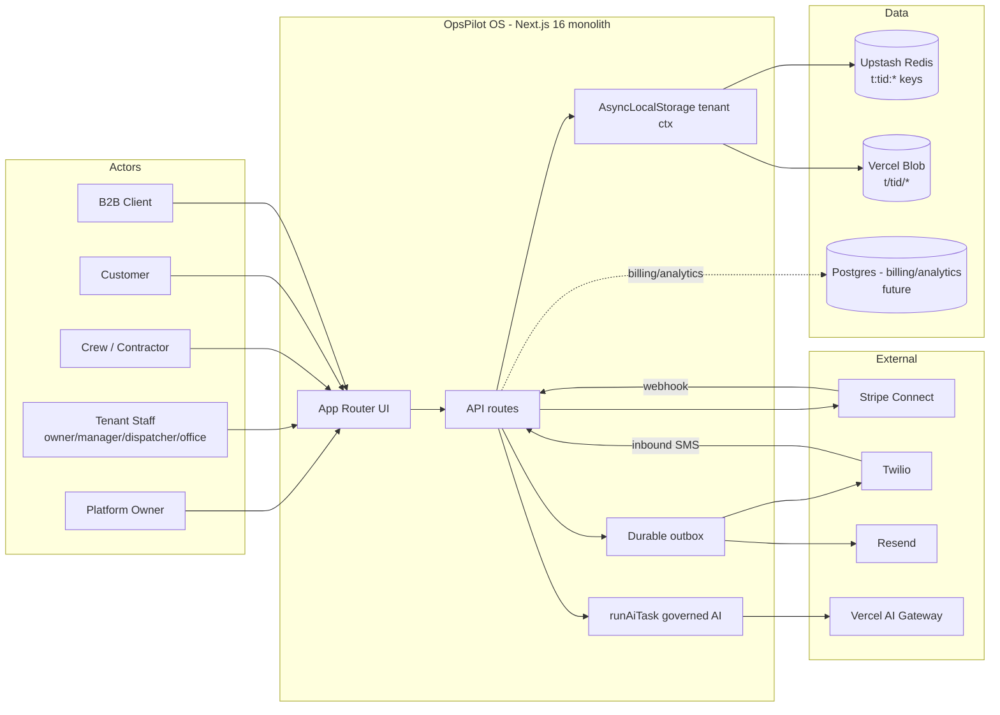

# 14 — Target Architecture (Phase 13)

> Cited to `file:line` on `~/jkissllc@main`, 2026-07-12. Recommendation with
> Mermaid diagrams (sources in `diagrams/`).

## 1. Architecture choice: **Modular Monolith** (RECOMMENDATION)

Keep the Next.js 16 App Router monolith. Do **not** move to SOA/microservices —
the app's coupling is already funneled through two chokepoints, the team is
founder-led, and the realistic tenant scale for years is served fine by one
well-structured deployment + Redis + a durable outbox. Microservices would add
operational cost with no benefit at this stage.

Prefer the **simplest architecture that safely supports the product**: modular
monolith, tenant context via `AsyncLocalStorage`, key-prefix isolation, durable
outbox for async work, relational store added only for billing/analytics.

## 2. Three states

### Current (FACT)
Single-tenant Next.js monolith · Upstash Redis (global keys) · Vercel Blob ·
inline side-effects · multi-user RBAC without tenant · governed AI (advisory) ·
no observability. Diagram: `diagrams/01-system-context.mmd`,
`diagrams/09-multi-tenant-data-boundaries.mmd` (before).

### Transitional (the migration target of Phases 1–5)
Same monolith + **tenant context** (`AsyncLocalStorage`) established in `proxy.ts`
· Redis keys prefixed `t:{tid}:` inside `call()` · `requireTenantSession`
principal · per-tenant credentials via context · `hauling-boxtruck` industry
pack extracted · durable outbox + typed events · flags/kill-switches · Sentry +
structured logs. Still one deployment; `t:jkiss` byte-identical to today.

### Target (multi-tenant AI Business OS)
Pooled multi-tenant monolith · tenant resolution (subdomain/custom-domain) →
context · full isolation (data/auth/storage/webhook/job/AI/analytics/audit) ·
Industry Packs + Tenant Config · governed AI up to Level-4 with approval queue +
action executor + kill switch · Stripe Connect + platform billing · Postgres
(Neon) for billing ledger + cross-tenant analytics · observability stack (Tier
1–2). Diagram: `diagrams/02-container-architecture.mmd`.

## 3. The fifteen required elements (RECOMMENDATION)

1. **Domain boundaries** — the `04-...` domains as modules under `app/lib/*`;
   no cross-domain reach-around; communicate via typed functions + events.
2. **Module communication** — synchronous typed calls within a request; durable
   **outbox** for anything async/cross-domain (`08-...`).
3. **Background processing** — extend the 5-min cron into an outbox drainer +
   per-tenant fan-out (mind Vercel cron limits → one dispatcher cron iterating
   tenants, not one cron per tenant).
4. **Event strategy** — in-process events + transactional outbox; no bus.
5. **Data-access rules** — **all** tenant data through `redis.ts` `call()` (now
   prefixing); the two bypass files migrated; no raw Upstash fetch in feature code.
6. **API boundaries** — `/api/admin/*` (tenant staff), `/api/portal/*` (crew),
   `/api/(public)/*` (token-bearer), `/api/platform/*` (NEW — platform owner),
   `/api/webhooks/*`, `/api/cron/*`.
7. **AI orchestration boundaries** — everything through `runAiTask`; tools
   declare `{permission, actionLevel, writes}`; Context Service redacts +
   tenant-scopes; approval queue gates Level-3+.
8. **Deployment model** — single Vercel project, pooled tenancy; per-tenant
   custom domains mapped to the one deployment.
9. **Scaling strategy** — vertical first (Fluid Compute, Upstash tier); shard
   Redis by tenant only if a hotspot appears; Postgres read replicas for
   analytics later.
10. **Security boundaries** — tenant prefix (data), `requireTenantSession`
    (authz), per-tenant credentials (context), Connect (money), kill switches (AI).
11. **Tenant-isolation model** — pooled + key-prefix + context; documented
    platform-scoped exceptions (`09-...`).
12. **Integration model** — Stripe Connect, Resend per-tenant domain, Twilio
    subaccounts, AI Gateway platform-owned + per-tenant metering.
13. **Observability** — Sentry + structured logs + AI telemetry + health/uptime
    (`12-...`).
14. **Config/versioning** — layered typed config, versioned per section (`06-...`).
15. **Testing** — authorization-coverage + tenant-isolation as GA gates (`13-...`).

## 4. Diagrams

Mermaid sources are in `diagrams/`. Rendered inline here for the two most
load-bearing views; the rest are referenced.

### System context (`diagrams/01-system-context.mmd`)


### Multi-tenant data boundaries (`diagrams/09-multi-tenant-data-boundaries.mmd`)
```mermaid
flowchart TB
  Req[Request] --> Proxy[proxy.ts\nresolve tenant from host/subdomain]
  Proxy --> Ctx[AsyncLocalStorage\ntenantId + principal]
  Ctx --> Call[redis.ts call() prefixes t:tid:]
  Call --> A[t:acme:bk:*]
  Call --> B[t:jkiss:bk:*]
  Platform[platform:* keys\nTenant, IndustryPack, waitlist, billing] --- Call
  Bypass[track + admin/analytics\nMUST be hand-migrated] -.->|risk if missed| A
```

Additional diagram sources provided: `02-container-architecture.mmd`,
`03-business-domains.mmd`, `04-user-role-relationships.mmd`,
`05-ai-request-approval-flow.mmd`, `06-job-lifecycle.mmd`,
`07-quote-to-cash.mmd`, `08-event-processing-flow.mmd`.
